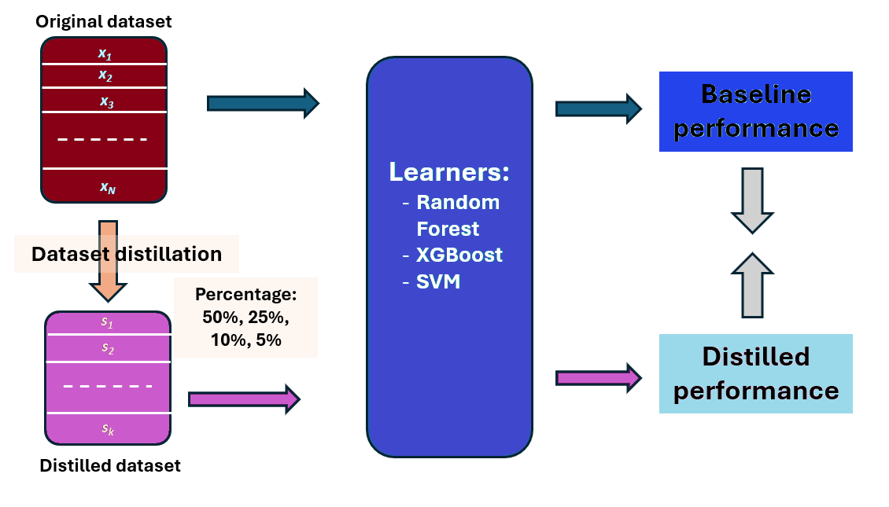

# Tabular Data Distillation: Comparative Study

## 1. Purpose

This repository provides a unified experimental framework for **comparing data distillation methods for tabular datasets**.

The goal is to:
- Evaluate different distillation strategies under a common pipeline
- Measure their impact on learning performance, runtime, and data characteristics
- Support reproducible experimentation across multiple datasets and methods

Notes: 
- Distillation method are unsupervised, as they do not use labels


The focus is on **tabular data**, with an emphasis on **dataset reduction**, **runtime efficiency**.

This repository accompanies
[1] C. Florea and E. Barnoviciu.  
**Tabular Data Distillation: An Extensive Comparison**  
under review, 2026.


---

## 2. Pipeline Overview

The experimental pipeline is showed in the following figure and contains these steps:

1. Dataset acquisition
2. Data cleaning and structuring
3. Application of distillation methods
4. Model training and evaluation
5. Utility analyses (tailness, visualization, duration)



---

## 3. Code Structure

### 3.1 Package Requirements

This project relies on standard Python scientific and machine learning libraries.

Key dependencies include:
- os
- NumPy
- SciPy
- scikit-learn
- pandas
- matplotlib / seaborn
- umap-learn
- sdv (for generative distillation methods)
- PyTorch (for sdv)
- ucimlrepo (for UCI dataset acquisition)
- kaggle (for Kaggle dataset acquisition)

A full list of requirements is provided in `requirements.txt`.

---

### 3.2 Data

#### 3.2.1 Dataset Gathering

Datasets are obtained from public repositories:
- UCI
- Kaggle
- OpenML or other academic sources

Scripts are provided to:
- Download datasets once
- Store them locally
- Load them offline for reproducibility

Each dataset is stored in its own directory.

While the code automatically make a separation between Classification and Regression, it is advisable to check this manually as some datasets may be used for both task.

The datasets can be handled better if saved in a specific structure:
```
repo/
├── datasets/
│   └── Classification/
│		   ├── DatasetC1/
│          │	├── X.npy
│		   │    └── Y.npy
│        .................
│          └── DatasetCn/
│       		├── X.npy
│			    └── Y.npy
│   └── Regression/
│		   ├── DatasetR1/
│          │	├── X.npy
│		   │    └── Y.npy
│        .................
│          └── DatasetR2/
│       		├── X.npy
└			    └── Y.npy


```

The code to download the datasets and store them is as following:

- UCI (most database and best maintained):
```
.\data\load_ucirepo_tabular.py 
```

- Kaggle (maintainance per database - lucky):
```
.\data\load_kaggle_tabular.py  	
```

-OpenML (was under maintainance when we started this project):
```
.\data\load_openml_tabular.py
```

All these will save an `X.npy` and `Y.npy` into `Dataset_name` folder

#### 3.2.2 Cleaning and Structuring

All datasets are converted into a unified format:
- Feature matrix stored as `X.npy`
- Labels stored as `Y.npy`

Preprocessing steps may include:
- Forming the train and test sets
- Handling missing values
- Encoding categorical variables
- Feature scaling or normalization

For Kaggle sets there is specific cleaning needed:
```
.\data\clean_kaggle_sets.py
```

All sets are cleaned and the expected files form by:
```
.\data\clean_labels.py
```
Notes:
1. Once the cleaned trained and test sets are formed, in each database, one will see: `X_train.npy`, `Y_train.npy`, `X_test.npy`, `Y_test.npy`.
2. In the distillation process  `X_train.npy` (to compute ditilled data) and `Y_train.npy` (to established labels for the distilled data)
3. `X_test.npy`, `Y_test.npy` are used in the learner evaluation process
---


### 3.3 Applying Distillation

The framework supports multiple distillation methods, including:
- Clustering-based methods (e.g., k-means)
- Core-set selection methods (Gonzales Algorithm) and Coreset PCA-based leverage score sampling
- Generative approaches (e.g., CTGAN, TVAE)
- Gaussian based generation: Gaussian_Copula_synthesizer and GaussianMixtureModels

Each method is applied at specific reduction percentages 50%, 25%, 10%, 5%.

Distillation methods are contained in:

```
.\tabular_distillation_method.py
```
The distillation methods may be run, on all datasets, with parallelization, by:
```
.\tabular_run_distil_methods.py
```
Alternatively, they can be run in SingleThread mode:
```
.\tabular_run_distil_methods_SingleThread.py
```
In either case, in the main function one needs to set: (i) Root_Folder, (ii) Percentages. On the top of the file, one needs to select (iii) which distillation method is applied.

Once a distillation method is applied, it will save in the database folder a pair of files that contained the distilled version
```
X_DistilName_Precent.npy
Y_DistilName_Precent.npy
```

---

### 3.4 Applying Learning

After distillation, standard classifiers and regressor are trained on the reduced datasets.

Supported models include:
- Random Forest
- Support Vector Machines (SVM)
- Gradient Boosting / XGBoost 

Performance is evaluated on a held-out test set using metrics such as:
- Classification:
	- Accuracy 
	- Average (Balanced) Accuracy
- Regression:
	- Mean Square Error
	- Pearson Correlation Coefficient


To apply the learners on all sets choose one of the following:
```
.\tabular_run_classifiers.py
.\tabular_run_regressor.py
```

Notes:
1. Every time the learners, in both classification and regression run a grid search
2. The Grid search is done with parallilaztion on Core threads
3. Both best metric value, as well as results while doing grid search are stored (appended) into a `results.npy`
4. To get the results from all databases, after configuring the metrics, run:
```
.\Results_CSV_on_distillation.py # for classifications sets
.\Results_CSV_on_distillation_v_regr.py #for regression sets
```
---

### 3.5 Utilities

#### 3.5.1 Tailness Analysis

Statistical measures are provided to characterize dataset tail behavior, including:
- Skewness
- Kurtosis
- Quantile-based tail ratios
- Mahalanobis-distance-based tail metrics

These measures are computed per dataset and aggregated for analysis. Run:
```
.\tailness_datasets.py
```
---

#### 3.5.2 Visualization

Dimensionality reduction techniques are used to visualize datasets before and after distillation:
- PCA
- t-SNE
- UMAP

Visualizations support qualitative comparison of:
- Class separability
- Coverage
- Geometric structure preservation

Plots can be saved automatically as image files. Run
```
.\dataset_visualization.py
```

---

#### 3.5.3 Duration Measurement

Runtime measurement utilities are included to:
- Measure distillation execution time
- Log results per dataset, method, and reduction percentage
- Export timing results to CSV files for benchmarking

This enables systematic comparison of computational efficiency. This information is saved into `results.npy` while applying distillation methods

---

## Notes

This repository is intended as a **research and experimentation framework**.
Users are encouraged to adapt, extend, and refine individual components depending on their use case.

---
